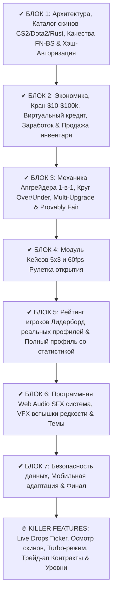

# 🏆 SIMUP (Simulator Upgrade) — Полный архитектурный план разработки

Проект **SIMUP** — это высокотехнологичный симулятор скинового апгрейдера (CS2, Dota 2, Rust) с математикой 1 в 1, реалистичной экономикой, ультрасовременным 60fps-дизайном, звуковыми эффектами, системой кредитования и отсутствием риска реальных денег.

---

## 📌 Общий обзор этапов (Блоков)

---

## 🔍 Детализация каждого блока

### [✔] БЛОК 1: Архитектурный фундамент, База скинов и Аутентификация
* **SPA-структура:** чистый HTML5 + Vanilla CSS + Модульный ES6 JavaScript (мгновенная загрузка без зависимостей).
* **Каталог 3-х игр:**
  * **CS2:** Ножи (Karambit Doppler P2, Butterfly Fade, M9 Bayonet Lore, Skeleton Crimson Web), перчатки (Vice, Snow Leopard), винтовки (Howl, Wild Lotus, Fire Serpent, Case Hardened #661, Printstream), снайперки (Dragon Lore, Gungnir, Desert Hydra, Asiimov), пистолеты.
  * **Градации качества для CS2:** Factory New (FN), Minimal Wear (MW), Field-Tested (FT), Well-Worn (WW), Battle-Scarred (BS) с точными ценами.
  * **Dota 2:** Dragonclaw Hook, Golden Baby Roshan, Mace of Aeons, Vigil Triumph, Арканы на Pudge, PA, Juggernaut и др.
  * **Rust:** Big Grin, Punishment Mask, Alien Red, Glory AK47, Tempered AK47, Glowing двери и ящики.
* **Фильтры и поиск:** по играм, редкости (★, Тайное, Засекреченное и т.д.), диапазону цен, сортировка по цене и поиск.
* **Авторизация и безопасность:**
  * Окно входа/регистрации при первом посещении.
  * Контроль уникальности никнеймов.
  * Криптографическое хэширование паролей: **SHA-256 + Salt** через Web Crypto API.
  * Выбор боевой аватарки.
  * Стартовый бонус **$500.00** и подарочный скин в инвентарь.
* **Темы интерфейса:** 4 цветовые схемы (Emerald Neon, Cyber Violet, Amber Fire, Ice Sapphire).
* **Toast-уведомления:** анимированные плашки событий с прогресс-баром.

---

### [✔] БЛОК 2: Экономика, Кредиты, Бесплатные пополнения и Управление инвентарем
* **Бесплатный кран пополнения (Free Faucet):**
  * Модальное окно с выбором точной суммы: быстрые кнопки (+$10, +$50, +$100, +$500, +$1,000, +$10,000, +$100,000) или ручной ввод от $10 до $100,000.
  * Эффектная анимация начисления баланса.
* **Система виртуального кредита (Виртуальный банк):**
  * Возможность взять заём под 10% годовых/раундовых.
  * Ограничение кредитного лимита в зависимости от уровня и оборота игрока.
  * Кнопка частичного и полного погашения долга.
  * Учет долга: должники отображаются в отдельной секции Лидерборда ("Самые большие должники").
* **Способы заработка монет без депозита:**
  * **Daily Streak (Ежедневная награда):** 7-дневный цикл наград с прогрессивным увеличением ($25 в день 1 → до $500 + секретный кейс в день 7).
  * **Система достижений (Achievements):** денежные награды за выполнение целей:
    * *«Первые шаги»* — первый апгрейд (+$50).
    * *«Снайпер»* — победа с шансом <5% (+$250).
    * *«Хайроллер»* — ставка от $1,000 (+$500).
    * *«Коллекционер»* — 10 предметов в инвентаре (+$300).
    * *«Кредитный барон»* — взять и полностью погасить кредит (+$150).
* **Управление инвентарем:**
  * Быстрая продажа любого скина в баланс сайта по рыночной цене (1 клик).
  * Кнопка «Продать весь инвентарь» с подтверждением и подсчетом общей суммы.
  * Быстрый переход «Отправить в Апгрейд».

---

### [✔] БЛОК 3: Механика Апгрейдера 1-в-1, Круг Over/Under и Provably Fair
* **Точная математическая модель (1 в 1 с CSGORoll / Key-Drop):**
  $$\text{Шанс (\%)} = \min\left(90\%, \max\left(0.05\%, \frac{\text{Ставка}}{\text{Цена скина}} \times (1 - \text{Комиссия}) \times 100\%\right)\right)$$
  * Комиссия сайта (House Edge): 8% по умолчанию с возможностью переключения в режим "0% Honest".
* **Интерактивный 60fps Canvas / SVG Круг Апгрейда:**
  * Выбор направления: **Over** (верхняя/правая часть) vs **Under** (нижняя/левая часть).
  * Свободное вращение выигрышного сектора.
  * Быстрые множители: **1.5x, 2x, 5x, 10x, 20x, 50x, 100x**.
  * Плавное физическое вращение стрелки с реалистичным замедлением (cubic-bezier) и точной остановкой на выигрышном/проигрышном градусе.
* **Ставки:**
  * Ставка прямо с баланса (Quick Balance Upgrade).
  * Мульти-апгрейд: выбор одного или нескольких скинов из инвентаря + добавление баланса.
* **Система Provably Fair (Доказуемая честность):**
  * Генерация Server Seed (хэширован SHA-256 до броска), Client Seed и Nonce.
  * Окно проверки любого завершенного раунда с возможностью скопировать семена и сверить честность.

---

### [✔] БЛОК 4: Модуль Кейсов (5 уникальных кейсов по каждой игре)
* **15 эксклюзивных кейсов (по 5 на игру):**
  * **CS2:** «Knife Dream», «Covert Beast», «Sniper Elite», «Budget Rush», «Vintage Legends».
  * **Dota 2:** «Arcana Vault», «Immortal Dominion», «Carry Arsenal», «Midlane Glory», «Roshan's Treasure».
  * **Rust:** «Glowing Night», «Raider's Armory», «Scrap Fortune», «Tempered Steel», «Toxic Wasteland».
* **Горизонтальная 60fps рулетка открытия:**
  * Плавная прокрутка с тикающим звуком пролетающих скинов и замедлением перед стрелкой.
  * Предпросмотр содержимого кейса с отображением точных шансов дропа каждого предмета в %.
  * Экран выигрыша: скин сразу можно продать в баланс или отправить в Апгрейд.

---

### [✔] БЛОК 5: Рейтинг игроков (Лидерборд) и Профиль
* **Лидерборд реальных профилей:**
  * Вкладка **«Самые богатые»** (топ по чистому профиту Net Profit = Баланс + Инвентарь - Депозиты).
  * Вкладка **«Главные должники»** (топ игроков с открытыми долгами по кредитам).
  * Таблица сохраняет реальные аккаунты, зарегистрированные на сайте.
* **Расширенная статистика профиля:**
  * Winrate (%), количество побед и поражений.
  * Самый крупный занос (Best Drop) и максимальный множитель.
  * Суммарный объем ставок (Total Wagered).
  * Интерактивная история последних 50 игр с фильтрами («Все», «Апгрейды», «Кейсы») и кнопкой аудита Provably Fair.

---

### [✔] БЛОК 6: Web Audio SFX, Визуальные спецэффекты (VFX) и Темы
* **Синтезированная звуковая система Web Audio API (работает офлайн, без mp3):**
  * Тиканье стрелки колеса с ускорением и затуханием.
  * Звук барабана кейса.
  * Победный фанфар / звон монет при выигрыше.
  * Звук драматического поражения.
  * Щелчки по кнопкам и переключателям.
* **VFX-эффекты:**
  * Вспышки в цвет редкости предмета (золотое сияние для ножей и Arcanas, красное для Covert).
  * Динамический салют (конфетти на Canvas) и shake-эффект экрана при выигрышах.
* **4 темы оформления:** Emerald Neon, Cyber Violet, Amber Fire, Ice Sapphire.

---

### [✔] БЛОК 7: Безопасность, Мобильная оптимизация и Полировка
* Валидация всех математических операций на стороне контроллеров.
* Защита от переполнения и подделки локального состояния.
* 100% мобильная адаптивность: сенсорные жесты, удобное меню, выдвижные шторки инвентаря для смартфонов.

---

### [✔] БЛОК 8: Killer Features & Дополнительный функционал
* **Live Drops Ticker (Живая лента дропов):**
  * Потоковая горизонтальная лента под шапкой с карточками выигрышей (апгрейды, кейсы, контракты).
  * Интерактивный клик по карточке дропа открывает окно детального осмотра предмета.
* **Модальное окно осмотра скина (Skin Inspector):**
  * Точный float износа скина (например, `0.02148`).
  * Игра, редкость, рыночная цена.
  * Кнопка «🎯 Поставить целью Апгрейда» в 1 клик переносит скин на арену и скроллит к ней.
* **Турбо-режим (Turbo Mode):**
  * Переключатель ⚡ Турбо ускоряет спин колеса апгрейдера с 4.6 сек до 1.2 сек.
* **Трейд-ап Контракты обмена (Trade-Up Contracts):**
  * Рабочий стол на 10 слотов с переработкой скинов инвентаря.
  * Автозаполнение «+ Добавить дешевые».
  * Математика с окупаемостью от 0.85x до 2.85x.
* **Система уровней игрока (Player Leveling & XP):**
  * Значки `LVL` в шапке и прогресс-бар XP в профиле игрока с расчетом оборота ставок.
* **Глобальные горячие клавиши (Hotkeys):**
  * `Space` — запуск апгрейда / прокрутки кейса.
  * `ESC` — закрытие любого модального окна.
  * `1` - `7` — быстрый выбор множителей (1.5x, 2x, 5x, 10x, 20x, 50x, 100x).
* **Колесо Фортуны (Lucky Wheel):**
  * 60fps Canvas-колесо с 8 секторами: денежные призы ($10–$500), скины CS2 и Dota 2.
  * Физика замедления, звуки тиканья стрелки и салют джекпота.
  * 24-часовой таймер кулдауна с обратным отсчетом.
* **Конструктор пользовательских кейсов (Case Builder):**
  * Создание собственных кейсов с 3–10 скинами из каталога.
  * Автоматический математический расчет вероятностей по обратному весу стоимости ($W = 1 / P^{0.82}$).
  * Автоматический расчет честной цены кейса с 5% комиссией дома.
  * Интеграция кастомных кейсов в общую 60fps рулетку и фильтр «⭐ Мои кейсы».
* **Мини-игра «Мины» (Mines 5x5 Grid):**
  * Поле 5x5 (25 клеток) с настраиваемым количеством бомб (от 1 до 24).
  * Математическая модель казино 1-в-1 с 3% house edge: $M_k = 0.97 \times \prod_{i=0}^{k-1} \frac{25-i}{25-m-i}$.
  * Кристальный процедурный перезвон с повышением полутонов Web Audio (`playGem`) и резонансный взрыв (`playExplosion`).
  * Полный кэшаут в любой момент или автоматический джекпот при открытии всех алмазов.
* **Интерактивный регулятор громкости и пресеты звука:**
  * Выпадающий поповер в шапке с ползунком громкости (0%–100%) и пресетами (0%, 30%, 70%, 100%).
  * Динамическое масштабирование амплитуды процедурных осцилляторов Web Audio API без артефактов.
* **Ежедневные задания и Battle Pass (Daily Quests & Champion Chest):**
  * Роллинг-квесты на 24 часа с авто-отслеживанием всех игровых действий:
    1. «Апгрейд-мастер» (3 победы в Апгрейде) → +$75 и +150 XP.
    2. «Король кейсов» (2 открытия кейсов) → +$100 и +200 XP.
    3. «Опытный сапёр» (кэшаут от 2.0x в Минах) → +$125 и +250 XP.
    4. «Магистр крафта» (1 подписанный контракт) → +$150 и +300 XP.
    5. «Колесо Фортуны» (1 спин колеса) → +$50 и +100 XP.
  * **Супер-Бонус Чемпиона:** открытие запечатанного золотого сундука при закрытии всех 5 заданий дня (+$500.00, +500 XP и случайный секретный скин!).
* **Арена Coinflip 1v1 (Дуэли с 3D-монеткой):**
  * Классический выбор стороны: 🪙 **Terrorist (Золото T)** vs 🛡️ **Counter-Terrorist (Серебро CT)** с честным шансом ровно 50.00% (выигрыш 1.95x).
  * Ставка реальными долларами с баланса ИЛИ ставка любым скином из инвентаря против House Master.
  * 3D-физика вращения монеты на CSS 3D Transforms (`rotateY(2880deg)`) с металлическим звуковым звоном и плавной остановкой.
  * Доказуемая честность Provably Fair SHA-256 (Server Seed, Client Seed, Nonce).
* **Краш-Ракета (Crash 60fps Canvas):**
  * Экспоненциальный взлет ракеты с физическими частицами двигателей и траекторной кривой ($e^{0.068t}$).
  * Авто-кэшаут с настраиваемыми множителями (1.50x, 2.00x, 5.00x, 10.0x или ручной ввод).
  * Мгновенный ручной кэшаут в любой момент полета.
  * Защита Provably Fair SHA-256 с 4% house edge и непредсказуемой криптографической точкой краша.
  * Интеграция в ленту Live Drops, общую статистику профиля, историю ставок и горячие клавиши (Space).

---

## 🚀 Все 8 блоков и дополнительные режимы полностью реализованы и готовы к игре!

