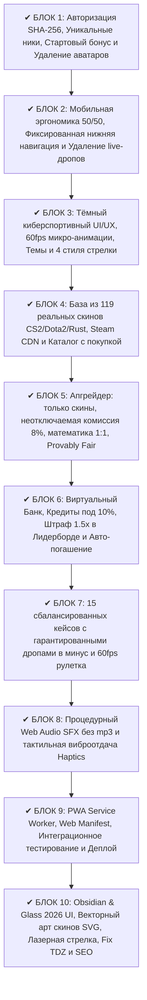

# 🏆 SIMUP 2.0 (Simulator Upgrade) — Архитектура и Релизная Спецификация

Проект **SIMUP 2.0** — это высокотехнологичный киберспортивный веб-симулятор апгрейда скинов (CS2, Dota 2, Rust) с математикой 1 в 1, реалистичной кредитной экономикой, 60fps микро-анимациями, процедурным звуковым движком Web Audio, тактильной мобильной виброотдачей и отсутствием риска реальных денег.

---

## 🌐 Ссылка на опубликованный проект:
👉 **[https://kipsway.github.io/simup/](https://kipsway.github.io/simup/)**

* **Репозиторий GitHub:** `https://github.com/kipsway/simup.git`
* **Ветка развертывания:** `main`

---

## 📌 Выполненные блоки разработки (SIMUP 2.0)

---

## 🔍 Спецификация ключевых подсистем

### 1. Авторизация и безопасность (Блок 1)
* **Алгоритм хэширования:** чистый побитовый fallback SHA-256 с динамической солью, гарантирующий 100% работоспособность в `file://`, мобильных webview, HTTP и HTTPS без сбоев Web Crypto API.
* **Регистрация и вход:** регистронезависимый поиск логина (`username.toLowerCase()`), мгновенный вход сразу после регистрации.
* **Удаление аватарок:** убраны все пользовательские аватары; профиль и интерфейс используют аккуратные монохромные бейджи с первой буквой ника.
* **Стартовый подарок:** новому игроку начисляется `$500.00` на баланс и коллекционный скин `AK-47 | Redline (FT)`.

### 2. Мобильная адаптация 50/50 (Блок 2)
* **Шапка сайта:** фиксированная высота 52px, устранено любое наслоение элементов на экран смартфона.
* **Подэкраны:** горизонтальная полоса переключения категорий с плавным touch-скроллом.
* **Нижний бар навигации (`.mobile-bottom-nav`):** фиксированная эргономичная панель с быстрым доступом (Апгрейд, Кейсы, Мины, Лидерборд, Кредиты, Профиль) и отступом `padding-bottom: 84px` от безопасной зоны экрана.
* **Удаление тикера live-дропов:** полностью убрана бегущая строка недавних дропов.

### 3. База скинов и каталог (Блок 4)
* **119 проверенных реальных скинов:**
  * **CS2 (94 варианта с градациями FN, MW, FT, WW, BS):** от G3SG1 Safari Mesh BS (`$0.12`) до Sport Gloves Vice FN (`$12,800.00`).
  * **Dota 2 (12 предметов):** от Belt of the Iron Surge (`$0.22`) до Golden Baby Roshan (`$2,850.00`).
  * **Rust (13 предметов):** от Nomad Shoes (`$0.25`) до Big Grin Mask (`$920.00`).
* **Steam Community CDN:** 100% скинов используют официальные изображения со встроенным fallback-обработчиком `onerror`.
* **Покупка в каталоге:** кнопка «Купить» для мгновенного пополнения инвентаря скинами любого тира.

### 4. Апгрейдер (Upgrader) (Блок 5)
* **Только скины:** в арену принимаются исключительно предметы из инвентаря игрока.
* **Неотключаемая комиссия 8%:** hardcoded `houseEdge = 0.08`, честная математическая формула:
  $$\text{Шанс (\%)} = \min\left(90.00\%, \max\left(0.05\%, \frac{\text{Сумма ставок скинов}}{\text{Цена целевого скина}} \times (1 - 0.08) \times 100\%\right)\right)$$
* **Фильтры инвентаря:** мульти-выбор, чипы «Дешевый» (авто-выбор самого доступного), «Все», «Сброс», сортировка по цене.
* **Стили стрелки:** переключение между 4 неоновыми скинами (`laser`, `blade`, `needle`, `classic`).
* **Provably Fair:** криптографический расчет угла остановки через `ServerSeed:ClientSeed:Nonce`.

### 5. Банковская система и кредит (Блок 6)
* **Ликвидация бесплатных кранов:** удалены кнопки бесконечного пополнения счета.
* **Виртуальный кредит:** возможность взять заём от `$50.00` с фиксированной комиссией 10%. Динамический лимит займа рассчитывается от уровня и оборота игрока.
* **Штраф 1.5x в Лидерборде:** сумма непогашенного долга умножается на 1.5 и вычитается из чистого профита (`Net Profit`) и капитала игрока (`Net Worth`). В таблице должников выводится бейдж `⚠️ Долг: -$X.XX`.
* **Авто-погашение (Auto-Repay):** 20% от чистого выигрыша в любой игре (Апгрейд, Кейсы, Монетка, Краш, Мины) автоматически списывается на погашение кредита.

### 6. 15 сбалансированных кейсов (Блок 7)
* **Правило баланса:** в каждом кейсе гарантированно присутствуют скины дешевле стоимости открытия кейса. Нет кейсов с гарантированным плюсом.
* **Сетка кейсов:**
  * **CS2:** «Бюджетный раш» (`$2.50`), «Снайперская элита» (`$15.00`), «Тайный зверь» (`$40.00`), «Винтажные легенды» (`$75.00`), «Мечта о ноже ★» (`$130.00`).
  * **Dota 2:** «Душа саппорта» (`$2.00`), «Триумф мидера» (`$6.00`), «Владения Immortal» (`$15.00`), «Хранилище Аркан» (`$32.00`), «Сокровищница Рошана» (`$85.00`).
  * **Rust:** «Скрап фортуна» (`$1.50`), «Токсичная пустошь» (`$5.00`), «Арсенал рейдера» (`$18.00`), «Ночное свечение» (`$40.00`), «Коллекционер масок» (`$90.00`).
* **60fps рулетка:** замедление `easeOutCubic` длительностью 5.2 секунды со звуковыми щелчками каждого скина.

### 7. Звуковой движок Web Audio и Haptics (Блок 8)
* **100% процедурный звук:** отсутствие внешних audio-файлов, нулевая задержка.
* **Палитра эффектов:** щелчки кнопок, тики рулетки со снижающейся частотой, лазерный разгон, мажорный фанфар победы, торжественный оркестровый джекпот, низкий тон поражения, кристальный перезвон алмазов в Минах, взрыв бомбы, звон монеты Coinflip, кассовый аппарат Банка и нарастающий гул ракеты Crash.
* **Тактильная виброотдача (Haptics):** легкий тап (12мс), микро-тик (6мс), победный дубль `[35, 45, 60]мс`, ритмичный джекпот `[50, 60, 50, 60, 100, 80, 150]мс`, глухой удар поражения (120мс) и взрыв `[160, 50, 80]мс`.
* **Обход автоплей-политики:** автоматическая активация AudioContext по первому жесту на странице.

### 8. PWA и деплой (Блок 9)
* **Web App Manifest (`manifest.json`):** возможность установки на домашний экран смартфонов в полноэкранном режиме (standalone).
* **Service Worker (`sw.js`):** кэширование стилей, скриптов и мгновенная загрузка.
* **Публикация на GitHub Pages:** ветка `main` автоматически синхронизирована с `origin`.

### 9. Obsidian & Glass 2026 Overhaul, Векторный арт и SEO (Блок 10)
* **Устранение TDZ-бага:** ликвидирована ошибка `ReferenceError: Cannot access 'ARROW_NAMES_MAP' before initialization`, разблокированы все обработчики событий кнопок и вкладок на сайте.
* **Процедурный SVG-векторный арт скинов:** движок `generateSkinSvg` генерирует для 100% скинов контрастные неоновые векторные силуэты оружия с подсветкой редкости, устраняя зависимость от блокируемых CDN Steam и внешних серверов. Загрузка 0 мс.
* **Редизайн стрелки апгрейда:** лазерная полигональная стрелка с diamond-наконечником (`clip-path: polygon(...)`), светящимся ореолом и акцентной точкой на центральном хабе.
* **Защита от переполнения шапки и баланса:** правила `flex-shrink: 0`, `min-width: max-content` и горизонтальная прокрутка навигации гарантируют, что баланс всегда помещается и виден на любых разрешениях экрана.
* **Удаление Provably Fair:** убраны панель и модальное окно проверки на честность, устранен визуальный шум.
* **Строгий запрет ставок деньгами:** кнопка апгрейда по умолчанию заблокирована с текстом `(Скины не выбраны)`, ставки возможны только инвентарём.
* **SEO и поисковая оптимизация:** созданы `robots.txt`, `sitemap.xml`, метатеги OpenGraph, Twitter Cards, канонический URL и микроразметка Schema.org `WebApplication` для бесплатной индексации в Google и Яндекс.
