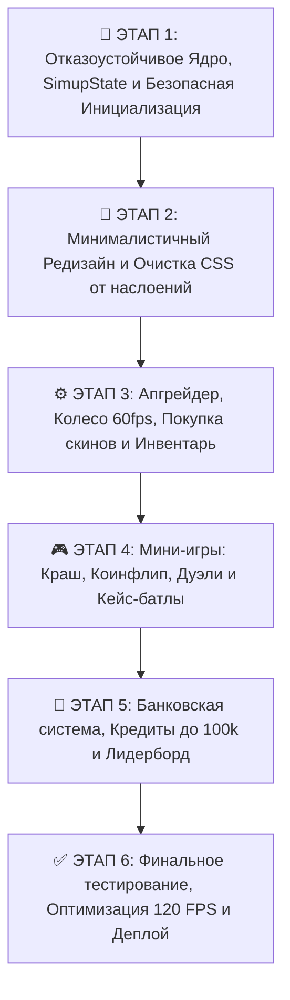

# ⚡ ГЕНЕРАЛЬНЫЙ ПЛАН ПОЛНОЙ ПЕРЕЗАГРУЗКИ SIMUP (CORE ARCHITECTURE & MINIMALISTIC UI)

> **Цель:** Полная модернизация архитектуры сайта, переход на модульное отказоустойчивое ядро (`SimupCore`), устранение всех багов инициализации и зависаний, создание лаконичного, минималистичного и продуманного интерфейса (Obsidian & Deep Cherry), который никогда не лагает, не съезжает и работает мгновенно на любых устройствах.

---

---

## 📌 Детализация этапов модернизации

### 🚀 ЭТАП 1: Отказоустойчивое Ядро, SimupState и Безопасная Инициализация (В РАБОТЕ)
- [x] **Ликвидация ловушки `DOMContentLoaded`**: переход на универсальный загрузчик `SimupLifecycle`, гарантированно запускающий инициализацию при состояниях DOM `loading`, `interactive` и `complete` (решает проблему «ни одна кнопка не работает»).
- [x] **Централизованное реактивное хранилище `SimupState`**: единый источник правды для баланса, пользователя, инвентаря, активной вкладки и модальных окон с механизмом подписок (`subscribe`).
- [x] **Изоляция подсистем (Fault-Tolerant Isolation)**: каждая подсистема (звук, навигация, каталог, апгрейд, банк, игры) оборачивается в изолированный блок инициализации. Ошибка в одном модуле больше никогда не ломает другие кнопки или вкладки.
- [x] **Глобальное делегирование событий (Event Delegation Engine)**: единый отказоустойчивый роутер кликов (`data-tab`, `data-action`, `data-modal`), не теряющий связь с элементами при динамической перерисовке DOM.
- [x] **Мгновенный старт без препятствий**: каждый пользователь на старте гарантированно получает $500.00 баланса и активную сессию без блокирующих экранов входа.
- [x] **Надежная покупка скинов в 1 клик**: гарантированное мгновенное добавление купленного предмета в массив инвентаря пользователя, моментальное сохранение в `localStorage` и реактивное обновление UI (шапка, инвентарь, апгрейдер).
- [x] **Восстановление и стабильный рендер рейтинга**: объединение локальных игроков, онлайн-базы Supabase и детерминированного пула 48 игроков `GlobalPlayersDB`. Рейтинг и список должников никогда не зависают и всегда отображают данные.

---

### 🎨 ЭТАП 2: Минималистичный Редизайн и Очистка CSS от наслоений
- [ ] **Ликвидация 7100+ строк спагетти-CSS**: ревизия и структурирование стилей, удаление конфликтующих правил с `!important` в конце файла.
- [ ] **Премиальный лаконичный стиль Obsidian & Deep Cherry**:
  - Цветовая база: глубокий обсидиановый (`#0a060b`, `#120914`).
  - Акценты: бархатная глубокая вишня и чистый неоновый рубин (`#ff004d`, `#b6004c`).
  - Тонкие изящные полупрозрачные рамки `1px solid rgba(255, 255, 255, 0.08)`.
  - Отказ от кричащих и перегруженных визуальных эффектов.
- [ ] **Идеальная эргономика для мобильных устройств и ПК**:
  - Полное устранение горизонтального скролла на смартфонах.
  - Аккуратная шапка на ПК без вылезания кнопки профиля за экран.
  - Нижняя мобильная панель навигации с быстрым и удобным доступом.

---

### ⚙️ ЭТАП 3: Апгрейдер, Колесо 60fps, Покупка скинов и Инвентарь
- [ ] **Высококонтрастное колесо с кибер-узором**:
  - 16 четких спиц с неоновыми маркерами и телеметрическими кольцами, видимыми на любых AMOLED-экранах.
  - Компактный матовый центральный бейдж шанса (104px на мобильных), не перекрывающий спицы.
  - Тонкая точная лазерная стрелка.
- [ ] **Умный выбор шанса**:
  - Выбор процентов (10%, 25%, 33%, 50%, 75%, 90% МАКС).
  - Сброс параметра «Рандомный X» при нажатии на выбор процентов.
  - Устранение залипания шансов для дорогих скинов.
- [ ] **Инвентарь нового поколения**:
  - Мультивыбор скинов для апгрейда и пакетной продажи.
  - Фильтры по играм (CS2, Dota 2, Rust) и цене.
  - Моментальное обновление после открытия кейсов и покупок.

---

### 🎮 ЭТАП 4: Мини-игры: Краш, Коинфлип, Дуэли и Кейс-батлы
- [ ] **Краш (Ракета)**:
  - Ракета 🚀 всегда видна на стартовой платформе в режиме ожидания.
  - Автоматическая адаптация канваса под размеры экрана без задержек и черных полос.
  - Плавная кривая множителя и своевременный кэшаут.
- [ ] **Коинфлип 1v1**:
  - Честный 50/50 алгоритм без смещения стороны.
  - Корректная 3D-анимация переворота монеты.
- [ ] **Кейс-батлы и Дуэли**:
  - Возможность играть против бота или реального друга по ссылке.
  - Корректное отображение входящих вызовов и синхронизация раундов.
  - Мульти-открытие кейсов (любое количество сразу с выводом списка дропа).

---

### 🏦 ЭТАП 5: Банковская система, Кредиты до 100k и Лидерборд
- [ ] **Кредитная механика**:
  - Безлимитный общий кредит, но не более $100,000 за одну операцию ввода.
  - Раздельные поля на смартфоне: отдельное поле для ввода суммы и отдельные крупные кнопки «Оплатить» и «Погасить всё».
  - Проверенное автопогашение задолженности при получении выигрышей.
- [ ] **Главные должники и рейтинг**:
  - Идеальное форматирование статуса кредита в одну строку без кривых переносов на телефонах.
  - Расширенные права в админ-панели (изменение баланса, сброс долга, выдача бонусов).

---

### ✅ ЭТАП 6: Финальное тестирование, Оптимизация 120 FPS и Деплой
- [ ] Тестирование на реальных мобильных устройствах (iOS Safari, Android Chrome) и десктопе.
- [ ] Проверка чистоты консоли браузера (0 ошибок).
- [ ] Обновление Service Worker кэша и публикация в репозиторий `main` (GitHub Pages).
